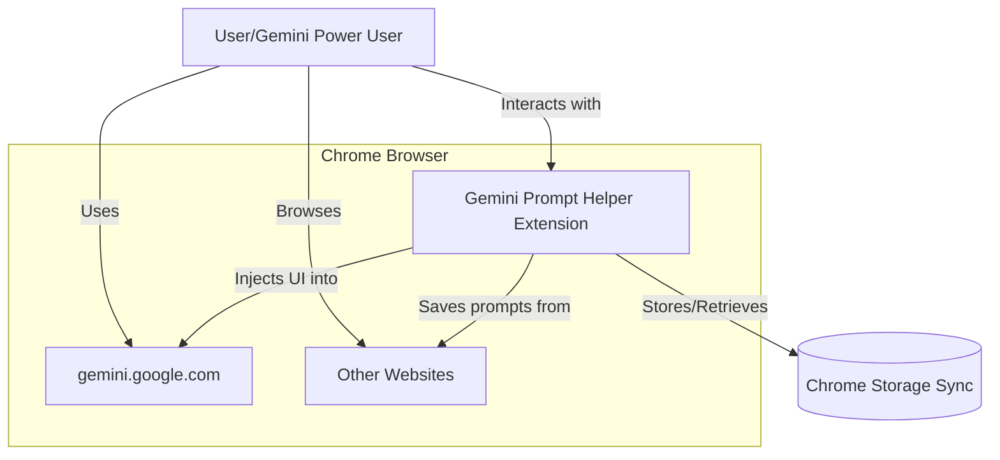
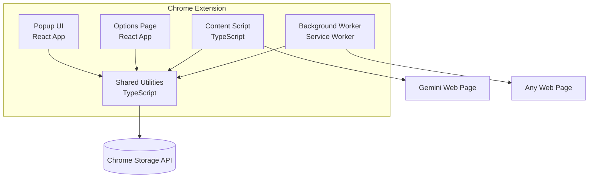
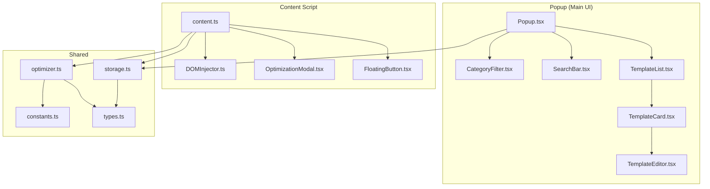
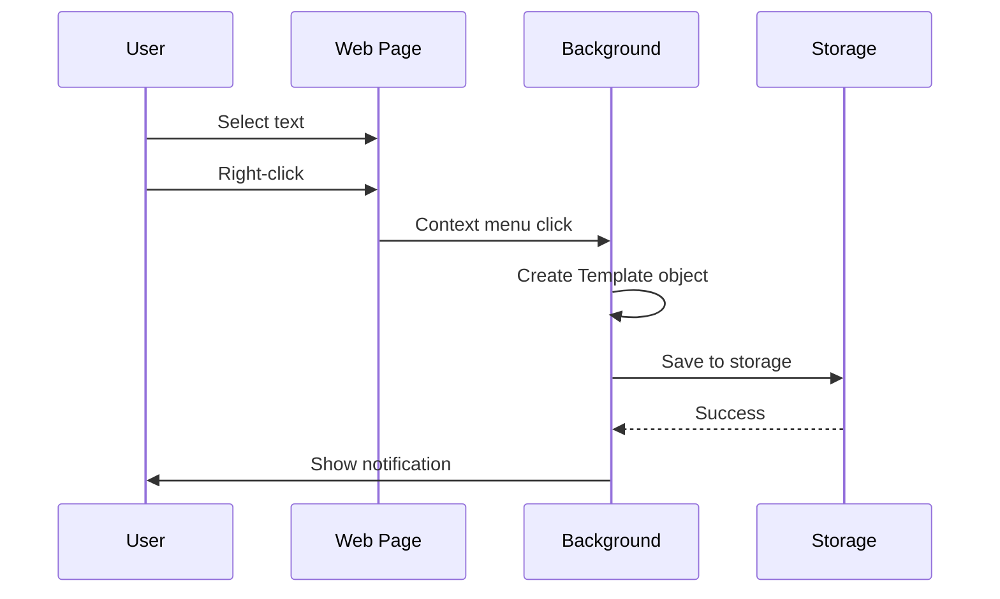
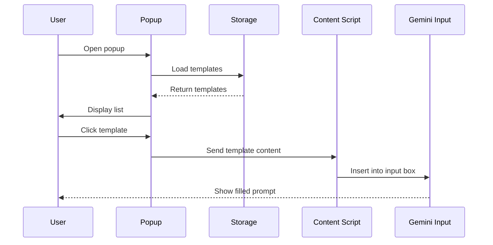

# Technical Architecture Document
# Gemini Prompt Helper Chrome Extension

**Version:** 1.0  
**Date:** December 16, 2024  
**Author:** SA Agent  
**Status:** Design Complete  
**Based on:** PRD v1.0

---

## 1. Executive Summary

This document provides the complete technical architecture for the Gemini Prompt Helper Chrome Extension. The extension will be built as a Manifest V3 Chrome Extension using React 18 + TypeScript, with Vite as the build tool.

**Key Architecture Decisions:**
- ✅ Chrome Extension (Manifest V3) - Modern, secure extension platform
- ✅ React 18 + TypeScript - Component-based UI with type safety
- ✅ Vite + vite-plugin-web-extension - Fast build and HMR
- ✅ Tailwind CSS - Utility-first styling for rapid UI development
- ✅ Chrome Storage Sync API - Cross-device template synchronization
- ✅ No Backend Required - 100% client-side, privacy-first

---

## 2. System Architecture

### 2.1 High-Level Architecture (C4 Context Diagram)



**Key Components:**
1. **Extension Popup** - Main UI for template management
2. **Content Script** - Injected into Gemini pages
3. **Background Worker** - Context menu and event handling
4. **Chrome Storage** - Persistent data storage

### 2.2 Container Diagram (Extension Components)



### 2.3 Component Diagram (Detailed Structure)



---

## 3. Technology Stack

### 3.1 Recommended Technology Stack

Following company standards for Chrome Extension development:

**Chrome Extension:**
- ✅ Manifest V3 (Latest Chrome Extension standard)
- ✅ Permissions: storage, activeTab, contextMenus, scripting
- ✅ Host Permissions: https://gemini.google.com/*

**Frontend Framework:**
- ✅ React 18.2+ with TypeScript 5.2+
- **Rationale:** Component-based architecture, excellent ecosystem, TypeScript for type safety

**Build Tool:**
- ✅ Vite 5.0+ with vite-plugin-web-extension 4.1+
- **Rationale:** Fast HMR, optimized builds, excellent DX

**Styling:**
- ✅ Tailwind CSS 3.4+
- **Rationale:** Utility-first, rapid development, small bundle size

**State Management:**
- ✅ React Context + Hooks (for popup)
- ✅ Local state for content scripts
- **Rationale:** Sufficient for extension complexity, no external dependencies needed

**Storage:**
- ✅ Chrome Storage Sync API
- **Rationale:** Cross-device sync, 100KB per item, 512 items max

**No Backend Required:**
- All logic client-side
- No API calls (except optional future enhancement)
- Privacy-first design

### 3.2 Technology Justification

| Requirement | Technology | Justification |
|------------|------------|---------------|
| Extension Platform | Manifest V3 | Modern, secure, required by Chrome |
| UI Framework | React 18 + TypeScript | Company standard, excellent for dynamic UI |
| Build Tool | Vite | Fastest build times, great DX |
| Styling | Tailwind CSS | Rapid development, small footprint |
| Storage | Chrome Storage Sync | Built-in sync, no backend needed |
| State Management | React Context | Sufficient for extension size |

---

## 4. Data Architecture

### 4.1 Data Models (TypeScript Types)

```typescript
// src/shared/types.ts

/**
 * Template Category Types
 */
export type CategoryType = 
  | 'text'       // Text generation prompts
  | 'image'      // Image generation prompts
  | 'video'      // Video generation prompts
  | 'code'       // Code generation prompts
  | 'data'       // Data analysis prompts
  | 'custom';    // User-defined category

/**
 * Template Variable for dynamic content
 */
export interface TemplateVariable {
  name: string;           // e.g., "SUBJECT"
  label: string;          // e.g., "Main Subject"
  defaultValue?: string;  // Optional default
  required: boolean;      // Is this variable required?
}

/**
 * Main Template Model
 */
export interface Template {
  id: string;                    // UUID v4
  title: string;                 // Max 100 chars
  category: CategoryType;        // Template category
  content: string;               // Prompt content (max 5000 chars)
  tags: string[];                // Max 10 tags, each max 30 chars
  variables: TemplateVariable[]; // Dynamic placeholders
  createdAt: string;             // ISO 8601 timestamp
  updatedAt: string;             // ISO 8601 timestamp
  usageCount: number;            // Track how often used
  isFavorite: boolean;           // User favorite flag
  source?: string;               // Optional: URL where saved from
}

/**
 * Category Statistics
 */
export interface CategoryStats {
  category: CategoryType;
  count: number;
  lastUsed?: string;
}

/**
 * Extension Settings
 */
export interface Settings {
  // Floating button settings
  floatingButtonEnabled: boolean;
  buttonPosition: 'top-right' | 'bottom-right' | 'top-left' | 'bottom-left';
  
  // Default behavior
  defaultCategory: CategoryType;
  autoOptimize: boolean;          // Auto-show optimization suggestions
  
  // UI preferences
  theme: 'light' | 'dark' | 'auto';
  compactView: boolean;
  
  // Advanced
  enableAnalytics: boolean;       // Anonymous usage stats (future)
}

/**
 * Chrome Storage Schema
 */
export interface StorageSchema {
  templates: Template[];          // Array of all templates
  settings: Settings;             // User settings
  metadata: {
    version: string;              // Data schema version
    lastBackup?: string;          // Last export timestamp
    installDate: string;          // Extension install date
  };
}

/**
 * Optimization Suggestion
 */
export interface OptimizationSuggestion {
  type: 'structure' | 'clarity' | 'specificity' | 'format';
  title: string;
  description: string;
  example?: string;
  priority: 'high' | 'medium' | 'low';
}

/**
 * Optimization Result
 */
export interface OptimizationResult {
  originalPrompt: string;
  optimizedPrompt: string;
  suggestions: OptimizationSuggestion[];
  detectedCategory: CategoryType;
  improvements: string[];         // List of improvements made
}

/**
 * Export/Import Format
 */
export interface ExportData {
  version: string;                // Export format version
  exportDate: string;             // ISO 8601 timestamp
  templates: Template[];
  settings?: Settings;            // Optional settings export
  metadata: {
    totalTemplates: number;
    categories: CategoryStats[];
  };
}
```

### 4.2 Storage Structure

**Chrome Storage Sync API Usage:**

```typescript
// Key structure in Chrome Storage
{
  // Main template storage (chunked if needed)
  "templates": [...],           // Array of Template objects
  
  // User settings
  "settings": {...},            // Settings object
  
  // Metadata
  "metadata": {...},            // Version info, install date
  
  // Search index (for fast searching)
  "search_index": {
    "keywords": ["keyword1", "keyword2", ...],
    "templateMap": {
      "keyword1": ["template-id-1", "template-id-2"],
      ...
    }
  }
}
```

**Storage Limits & Handling:**
- Chrome Storage Sync: 100KB per item, 512 items max, 100KB quota per user
- Strategy: Chunk large template arrays if needed
- Each template ~1-2KB average
- Practical limit: ~100-200 templates before needing chunking (depends on content length)
- No artificial limits imposed - users can store as many templates as Chrome Storage allows
- Implement automatic chunking when array size exceeds 90KB
- Show helpful message if approaching Chrome's quota limits

### 4.3 Data Flow Diagrams

**Save Template from Web:**


**Apply Template to Gemini:**


---

## 5. Chrome Extension Architecture

### 5.1 Manifest Configuration

```json
{
  "manifest_version": 3,
  "name": "Gemini Prompt Helper",
  "version": "1.0.0",
  "description": "Optimize your Gemini prompts and manage reusable templates for better AI results",
  
  "icons": {
    "16": "icons/icon16.png",
    "48": "icons/icon48.png",
    "128": "icons/icon128.png"
  },
  
  "action": {
    "default_popup": "src/popup/index.html",
    "default_icon": {
      "16": "icons/icon16.png",
      "48": "icons/icon48.png",
      "128": "icons/icon128.png"
    },
    "default_title": "Gemini Prompt Helper"
  },
  
  "background": {
    "service_worker": "src/background/background.ts",
    "type": "module"
  },
  
  "content_scripts": [
    {
      "matches": ["https://gemini.google.com/*"],
      "js": ["src/content/content.ts"],
      "css": ["src/content/content.css"],
      "run_at": "document_end"
    }
  ],
  
  "options_page": "src/options/index.html",
  
  "permissions": [
    "storage",
    "contextMenus",
    "activeTab",
    "scripting"
  ],
  
  "host_permissions": [
    "https://gemini.google.com/*"
  ],
  
  "web_accessible_resources": [
    {
      "resources": ["icons/*", "assets/*"],
      "matches": ["https://gemini.google.com/*"]
    }
  ]
}
```

### 5.2 Project Structure

```
gemini-prompt-helper/
├── public/
│   ├── manifest.json                 # Extension manifest
│   ├── icons/
│   │   ├── icon16.png
│   │   ├── icon48.png
│   │   └── icon128.png
│   └── assets/
│       └── templates/                # Pre-loaded templates
│           └── defaults.json
├── src/
│   ├── popup/                        # Main UI (Extension Popup)
│   │   ├── index.html
│   │   ├── index.tsx                 # Entry point
│   │   ├── Popup.tsx                 # Main component
│   │   ├── components/
│   │   │   ├── TemplateList.tsx     # Template grid/list view
│   │   │   ├── TemplateCard.tsx     # Single template card
│   │   │   ├── TemplateEditor.tsx   # Create/Edit modal
│   │   │   ├── SearchBar.tsx        # Search input
│   │   │   ├── CategoryFilter.tsx   # Category tabs
│   │   │   ├── ImportExport.tsx     # Import/Export UI
│   │   │   └── EmptyState.tsx       # No templates state
│   │   ├── hooks/
│   │   │   ├── useTemplates.ts      # Template CRUD operations
│   │   │   ├── useSearch.ts         # Search and filter logic
│   │   │   └── useSettings.ts       # Settings management
│   │   └── styles/
│   │       └── popup.css
│   ├── options/                      # Settings Page
│   │   ├── index.html
│   │   ├── index.tsx
│   │   ├── Options.tsx               # Main options component
│   │   ├── components/
│   │   │   ├── GeneralSettings.tsx  # General preferences
│   │   │   ├── TemplateManagement.tsx # Bulk operations
│   │   │   ├── ImportExportPanel.tsx
│   │   │   └── AboutSection.tsx
│   │   └── styles/
│   │       └── options.css
│   ├── content/                      # Content Script (Gemini Page)
│   │   ├── content.ts                # Main content script
│   │   ├── components/
│   │   │   ├── FloatingButton.tsx   # Optimize button
│   │   │   ├── OptimizationModal.tsx # Suggestions modal
│   │   │   └── TemplateQuickApply.tsx # Quick template selector
│   │   ├── dom/
│   │   │   ├── geminiDetector.ts    # Detect Gemini input box
│   │   │   └── domInjector.ts       # Inject UI elements
│   │   ├── content.css
│   │   └── styles/
│   │       └── floating.css
│   ├── background/                   # Background Service Worker
│   │   ├── background.ts             # Main worker
│   │   ├── contextMenu.ts            # Context menu handler
│   │   ├── messageHandler.ts        # Message routing
│   │   └── storageSync.ts            # Storage operations
│   └── shared/                       # Shared Code
│       ├── storage.ts                # Storage API wrapper
│       ├── optimizer.ts              # Prompt optimization engine
│       ├── types.ts                  # TypeScript types
│       ├── constants.ts              # Constants and configs
│       ├── utils.ts                  # Utility functions
│       ├── messaging.ts              # Chrome messaging wrapper
│       └── templates/
│           ├── rules.ts              # Optimization rules by category
│           └── defaults.ts           # Default templates
├── package.json
├── tsconfig.json
├── vite.config.ts
├── tailwind.config.js
├── postcss.config.js
└── README.md
```

### 5.3 Component Architecture

**Popup Component Tree:**
```
Popup.tsx
├── Header
│   ├── Logo
│   ├── SearchBar
│   └── SettingsButton
├── CategoryFilter
│   ├── TabButton (Text)
│   ├── TabButton (Image)
│   ├── TabButton (Video)
│   ├── TabButton (Code)
│   ├── TabButton (Data)
│   └── TabButton (Custom)
├── TemplateList
│   ├── TemplateCard (foreach template)
│   │   ├── TemplateTitle
│   │   ├── TemplatePreview
│   │   ├── TemplateMetadata
│   │   └── ActionButtons
│   │       ├── UseButton
│   │       ├── EditButton
│   │       ├── FavoriteButton
│   │       └── DeleteButton
│   └── EmptyState (if no templates)
└── Footer
    ├── NewTemplateButton
    └── ImportExportButton

Modal Overlays:
├── TemplateEditor
│   ├── TitleInput
│   ├── CategorySelect
│   ├── ContentTextarea
│   ├── TagsInput
│   ├── VariablesEditor
│   └── SaveButton
└── ImportExport
    ├── ExportSection
    └── ImportSection
```

---

## 6. Prompt Optimization Engine

### 6.1 Optimization Algorithm

```typescript
// src/shared/optimizer.ts

/**
 * Main optimization function
 */
export function optimizePrompt(
  prompt: string,
  category?: CategoryType
): OptimizationResult {
  // Step 1: Detect category if not provided
  const detectedCategory = category || detectCategory(prompt);
  
  // Step 2: Analyze prompt structure
  const analysis = analyzePrompt(prompt);
  
  // Step 3: Get applicable rules for category
  const rules = getOptimizationRules(detectedCategory);
  
  // Step 4: Generate suggestions
  const suggestions = generateSuggestions(analysis, rules);
  
  // Step 5: Build optimized prompt
  const optimizedPrompt = buildOptimizedPrompt(prompt, analysis, rules);
  
  // Step 6: List improvements
  const improvements = listImprovements(prompt, optimizedPrompt);
  
  return {
    originalPrompt: prompt,
    optimizedPrompt,
    suggestions,
    detectedCategory,
    improvements
  };
}
```

### 6.2 Optimization Rules by Category

**Text Generation Rules:**
```typescript
const textGenerationRules: OptimizationRule[] = [
  {
    id: 'text-format',
    name: 'Specify Format',
    check: (prompt) => !hasFormat(prompt),
    suggestion: 'Add desired format (essay, list, table, etc.)',
    template: 'Format: [SPECIFY]'
  },
  {
    id: 'text-tone',
    name: 'Define Tone',
    check: (prompt) => !hasTone(prompt),
    suggestion: 'Specify tone (formal, casual, professional, etc.)',
    template: 'Tone: [SPECIFY]'
  },
  {
    id: 'text-length',
    name: 'Set Length',
    check: (prompt) => !hasLength(prompt),
    suggestion: 'Define word count or detail level',
    template: 'Length: [SPECIFY words/characters]'
  },
  {
    id: 'text-audience',
    name: 'Target Audience',
    check: (prompt) => !hasAudience(prompt),
    suggestion: 'Specify who will read this',
    template: 'Audience: [SPECIFY]'
  },
  {
    id: 'text-context',
    name: 'Add Context',
    check: (prompt) => !hasContext(prompt),
    suggestion: 'Provide relevant background information',
    template: 'Context: [PROVIDE BACKGROUND]'
  }
];
```

**Image Generation Rules:**
```typescript
const imageGenerationRules: OptimizationRule[] = [
  {
    id: 'image-subject',
    name: 'Describe Subject',
    check: (prompt) => !hasDetailedSubject(prompt),
    suggestion: 'Add detailed subject description',
    template: 'Subject: [DETAILED DESCRIPTION]'
  },
  {
    id: 'image-style',
    name: 'Specify Art Style',
    check: (prompt) => !hasStyle(prompt),
    suggestion: 'Define art style (photorealistic, cartoon, etc.)',
    template: 'Style: [PHOTOREALISTIC/CARTOON/PAINTING/etc.]'
  },
  {
    id: 'image-lighting',
    name: 'Lighting Details',
    check: (prompt) => !hasLighting(prompt),
    suggestion: 'Describe lighting (natural, studio, dramatic, etc.)',
    template: 'Lighting: [SPECIFY]'
  },
  {
    id: 'image-composition',
    name: 'Composition',
    check: (prompt) => !hasComposition(prompt),
    suggestion: 'Define framing and perspective',
    template: 'Composition: [FRAMING, ANGLE, PERSPECTIVE]'
  },
  {
    id: 'image-quality',
    name: 'Quality Specs',
    check: (prompt) => !hasQuality(prompt),
    suggestion: 'Add quality requirements (4K, high detail, etc.)',
    template: 'Quality: [4K, HIGH DETAIL, etc.]'
  }
];
```

**Video Generation Rules:**
```typescript
const videoGenerationRules: OptimizationRule[] = [
  {
    id: 'video-duration',
    name: 'Specify Duration',
    check: (prompt) => !hasDuration(prompt),
    suggestion: 'Define video length',
    template: 'Duration: [X seconds/minutes]'
  },
  {
    id: 'video-opening',
    name: 'Opening Scene',
    check: (prompt) => !hasOpening(prompt),
    suggestion: 'Describe first scene in detail',
    template: 'Opening: [SCENE DESCRIPTION]'
  },
  {
    id: 'video-sequence',
    name: 'Scene Sequence',
    check: (prompt) => !hasSequence(prompt),
    suggestion: 'Break down scene by scene',
    template: 'Sequence: [SCENE 1, SCENE 2, ...]'
  },
  {
    id: 'video-camera',
    name: 'Camera Work',
    check: (prompt) => !hasCameraDetails(prompt),
    suggestion: 'Specify camera movements and angles',
    template: 'Camera: [MOVEMENTS, ANGLES]'
  },
  {
    id: 'video-audio',
    name: 'Audio Style',
    check: (prompt) => !hasAudioStyle(prompt),
    suggestion: 'Describe background music or sound',
    template: 'Audio: [MUSIC STYLE, SOUND EFFECTS]'
  }
];
```

**Code Generation Rules:**
```typescript
const codeGenerationRules: OptimizationRule[] = [
  {
    id: 'code-language',
    name: 'Programming Language',
    check: (prompt) => !hasLanguage(prompt),
    suggestion: 'Specify programming language',
    template: 'Language: [PYTHON/JAVASCRIPT/etc.]'
  },
  {
    id: 'code-functionality',
    name: 'Clear Functionality',
    check: (prompt) => !hasClearFunction(prompt),
    suggestion: 'Define what the code should do',
    template: 'Functionality: [DETAILED DESCRIPTION]'
  },
  {
    id: 'code-io',
    name: 'Input/Output',
    check: (prompt) => !hasInputOutput(prompt),
    suggestion: 'Provide input/output examples',
    template: 'Input: [EXAMPLE]\nOutput: [EXAMPLE]'
  },
  {
    id: 'code-style',
    name: 'Coding Style',
    check: (prompt) => !hasCodingStyle(prompt),
    suggestion: 'Specify style guide (PEP8, Google, etc.)',
    template: 'Style: [STYLE_GUIDE]'
  },
  {
    id: 'code-error',
    name: 'Error Handling',
    check: (prompt) => !hasErrorHandling(prompt),
    suggestion: 'Mention error handling requirements',
    template: 'Error Handling: [APPROACH]'
  }
];
```

### 6.3 Category Detection Algorithm

```typescript
/**
 * Detect prompt category based on keywords and patterns
 */
function detectCategory(prompt: string): CategoryType {
  const lower = prompt.toLowerCase();
  
  // Image generation keywords
  const imageKeywords = [
    'image', 'picture', 'photo', 'illustration', 'drawing',
    'generate', 'create', 'design', 'render', 'visualize',
    'photorealistic', 'cartoon', 'painting', 'sketch'
  ];
  
  // Video generation keywords
  const videoKeywords = [
    'video', 'animation', 'clip', 'footage', 'scene',
    'camera', 'transition', 'sequence', 'duration'
  ];
  
  // Code generation keywords
  const codeKeywords = [
    'code', 'function', 'class', 'script', 'program',
    'python', 'javascript', 'java', 'c++', 'typescript',
    'algorithm', 'implement', 'debug'
  ];
  
  // Data analysis keywords
  const dataKeywords = [
    'analyze', 'data', 'dataset', 'statistics', 'chart',
    'graph', 'visualize data', 'metrics', 'csv', 'table'
  ];
  
  // Count matches for each category
  const scores = {
    image: countMatches(lower, imageKeywords),
    video: countMatches(lower, videoKeywords),
    code: countMatches(lower, codeKeywords),
    data: countMatches(lower, dataKeywords)
  };
  
  // Return category with highest score
  const maxScore = Math.max(...Object.values(scores));
  
  if (maxScore === 0) return 'text'; // Default
  
  const category = Object.keys(scores).find(
    key => scores[key] === maxScore
  ) as CategoryType;
  
  return category;
}
```

---

## 7. Implementation Guide for Fullstack Agent

### 7.1 Development Phases

**Phase 1: Foundation (Days 1-3)**
1. Project setup with Vite + vite-plugin-web-extension
2. TypeScript configuration and type definitions
3. Tailwind CSS setup
4. Shared utilities (storage, types, constants)

**Phase 2: Core Storage (Days 4-5)**
1. Chrome Storage wrapper implementation
2. Template CRUD operations
3. Settings management
4. Import/export functionality

**Phase 3: Popup UI (Days 6-8)**
1. Main popup layout
2. Template list and cards
3. Search and filter functionality
4. Template editor modal
5. Category management

**Phase 4: Content Script (Days 9-11)**
1. Gemini page detection
2. Floating button injection
3. Optimization modal
4. Template application to input

**Phase 5: Background Worker (Days 12-13)**
1. Context menu setup
2. Message handling
3. Installation/update handlers

**Phase 6: Optimization Engine (Days 14-15)**
1. Optimization rules implementation
2. Category detection
3. Suggestion generation

**Phase 7: Polish & Testing (Days 16-18)**
1. UI polish and animations
2. Error handling
3. Performance optimization
4. Cross-browser testing

### 7.2 Critical Implementation Details

**Gemini Input Detection:**
```typescript
// src/content/dom/geminiDetector.ts

/**
 * Detect Gemini input box on the page
 * Gemini uses dynamic selectors, need multiple fallbacks
 */
export function detectGeminiInput(): HTMLElement | null {
  // Try multiple selectors (Gemini UI changes frequently)
  const selectors = [
    'textarea[aria-label*="message"]',
    'textarea[placeholder*="enter"]',
    'div[contenteditable="true"][role="textbox"]',
    '.ql-editor',
    // Add more selectors as fallbacks
  ];
  
  for (const selector of selectors) {
    const element = document.querySelector(selector);
    if (element && isVisible(element)) {
      return element as HTMLElement;
    }
  }
  
  return null;
}

/**
 * Wait for Gemini input to appear (for SPA navigation)
 */
export async function waitForGeminiInput(
  timeout: number = 5000
): Promise<HTMLElement> {
  return new Promise((resolve, reject) => {
    const startTime = Date.now();
    
    const check = () => {
      const input = detectGeminiInput();
      
      if (input) {
        resolve(input);
      } else if (Date.now() - startTime > timeout) {
        reject(new Error('Gemini input not found'));
      } else {
        setTimeout(check, 100);
      }
    };
    
    check();
  });
}
```

**Storage Chunking Strategy:**
```typescript
// src/shared/storage.ts

/**
 * Save templates with automatic chunking if needed
 */
export async function saveTemplates(
  templates: Template[]
): Promise<void> {
  const json = JSON.stringify(templates);
  const size = new Blob([json]).size;
  
  // Chrome Storage Sync limit: 100KB per item
  const CHUNK_SIZE = 90 * 1024; // 90KB to be safe
  
  if (size < CHUNK_SIZE) {
    // No chunking needed
    await chrome.storage.sync.set({ templates });
  } else {
    // Chunk into multiple items
    const chunks: string[] = [];
    let offset = 0;
    
    while (offset < json.length) {
      chunks.push(json.slice(offset, offset + CHUNK_SIZE));
      offset += CHUNK_SIZE;
    }
    
    // Save chunks
    const chunkData: Record<string, any> = {
      templates_count: chunks.length
    };
    
    chunks.forEach((chunk, index) => {
      chunkData[`templates_chunk_${index}`] = chunk;
    });
    
    await chrome.storage.sync.set(chunkData);
  }
}

/**
 * Load templates with automatic chunk reconstruction
 */
export async function loadTemplates(): Promise<Template[]> {
  const data = await chrome.storage.sync.get(null);
  
  if (data.templates) {
    // Not chunked
    return data.templates;
  }
  
  if (data.templates_count) {
    // Reconstruct from chunks
    const chunks: string[] = [];
    
    for (let i = 0; i < data.templates_count; i++) {
      chunks.push(data[`templates_chunk_${i}`]);
    }
    
    const json = chunks.join('');
    return JSON.parse(json);
  }
  
  return [];
}
```

### 7.3 Key Components Implementation

**Template Card Component:**
```typescript
// src/popup/components/TemplateCard.tsx

interface TemplateCardProps {
  template: Template;
  onUse: (template: Template) => void;
  onEdit: (template: Template) => void;
  onDelete: (id: string) => void;
  onToggleFavorite: (id: string) => void;
}

export function TemplateCard({
  template,
  onUse,
  onEdit,
  onDelete,
  onToggleFavorite
}: TemplateCardProps) {
  const [showFullContent, setShowFullContent] = useState(false);
  
  const truncatedContent = template.content.slice(0, 150) + '...';
  
  return (
    <div className="border rounded-lg p-4 hover:shadow-md transition">
      {/* Header */}
      <div className="flex items-start justify-between mb-2">
        <h3 className="font-semibold text-lg">{template.title}</h3>
        <button
          onClick={() => onToggleFavorite(template.id)}
          className="text-yellow-500"
        >
          {template.isFavorite ? '★' : '☆'}
        </button>
      </div>
      
      {/* Category Badge */}
      <div className="mb-2">
        <span className={`inline-block px-2 py-1 rounded text-xs ${
          getCategoryColor(template.category)
        }`}>
          {getCategoryIcon(template.category)} {template.category}
        </span>
      </div>
      
      {/* Content Preview */}
      <p className="text-sm text-gray-600 mb-3">
        {showFullContent ? template.content : truncatedContent}
        {template.content.length > 150 && (
          <button
            onClick={() => setShowFullContent(!showFullContent)}
            className="text-blue-500 ml-1"
          >
            {showFullContent ? 'Less' : 'More'}
          </button>
        )}
      </p>
      
      {/* Tags */}
      {template.tags.length > 0 && (
        <div className="flex flex-wrap gap-1 mb-3">
          {template.tags.map(tag => (
            <span key={tag} className="bg-gray-100 px-2 py-1 rounded text-xs">
              #{tag}
            </span>
          ))}
        </div>
      )}
      
      {/* Metadata */}
      <div className="flex items-center justify-between text-xs text-gray-500 mb-3">
        <span>Used {template.usageCount} times</span>
        <span>{formatDate(template.createdAt)}</span>
      </div>
      
      {/* Actions */}
      <div className="flex gap-2">
        <button
          onClick={() => onUse(template)}
          className="flex-1 bg-blue-500 text-white px-3 py-2 rounded hover:bg-blue-600"
        >
          Use Template
        </button>
        <button
          onClick={() => onEdit(template)}
          className="px-3 py-2 border rounded hover:bg-gray-50"
        >
          Edit
        </button>
        <button
          onClick={() => onDelete(template.id)}
          className="px-3 py-2 border border-red-200 text-red-600 rounded hover:bg-red-50"
        >
          Delete
        </button>
      </div>
    </div>
  );
}
```

**Floating Button Component:**
```typescript
// src/content/components/FloatingButton.tsx

export function FloatingButton({ onClick }: { onClick: () => void }) {
  const [visible, setVisible] = useState(false);
  const [position, setPosition] = useState({ top: 0, left: 0 });
  
  useEffect(() => {
    // Monitor input box changes
    const input = detectGeminiInput();
    if (!input) return;
    
    const observer = new MutationObserver(() => {
      const hasContent = input.textContent || input.value;
      setVisible(!!hasContent);
    });
    
    observer.observe(input, {
      characterData: true,
      childList: true,
      subtree: true
    });
    
    // Update position when window resizes
    const updatePosition = () => {
      const rect = input.getBoundingClientRect();
      setPosition({
        top: rect.top - 40,
        left: rect.right - 120
      });
    };
    
    updatePosition();
    window.addEventListener('resize', updatePosition);
    
    return () => {
      observer.disconnect();
      window.removeEventListener('resize', updatePosition);
    };
  }, []);
  
  if (!visible) return null;
  
  return (
    <button
      onClick={onClick}
      style={{ top: position.top, left: position.left }}
      className="fixed z-[9999] bg-gradient-to-r from-blue-500 to-purple-500 text-white px-4 py-2 rounded-full shadow-lg hover:shadow-xl transition flex items-center gap-2"
    >
      ✨ Optimize
    </button>
  );
}
```

---

## 8. Security & Privacy

### 8.1 Security Considerations

**Data Security:**
- All data stored locally (Chrome Storage)
- No external API calls (in MVP)
- No user tracking or analytics
- No third-party scripts

**Permissions Justification:**
- `storage` - Required for saving templates
- `contextMenus` - For right-click save functionality
- `activeTab` - For reading selected text
- `scripting` - For injecting content scripts

**CSP (Content Security Policy):**
```json
"content_security_policy": {
  "extension_pages": "script-src 'self'; object-src 'self'"
}
```

### 8.2 Privacy Compliance

**Data Collection:**
- ❌ No user identification
- ❌ No usage tracking
- ❌ No external data transmission
- ✅ All data stays on user's device

**GDPR Compliance:**
- Not applicable (no data processing)
- User has full control over data
- Can export/delete all data

---

## 9. Performance Optimization

### 9.1 Performance Targets

| Metric | Target | Measurement |
|--------|--------|-------------|
| Popup Open Time | <200ms | Time to interactive |
| Search Response | <100ms | Keystroke to results |
| Template Application | <50ms | Click to input fill |
| Content Script Injection | <500ms | Page load to ready |
| Storage Operation | <300ms | Save/load complete |

### 9.2 Optimization Strategies

**Bundle Size:**
- Code splitting for popup/options/content
- Tree shaking with Vite
- Lazy load heavy components
- Target: <500KB total bundle

**Rendering:**
- Virtual scrolling for large template lists
- Debounced search input
- Memoized components
- Optimistic UI updates

**Storage:**
- Indexed search for O(1) lookup
- Batch operations
- Compression for large templates
- LRU cache for frequent access

---

## 10. Testing Strategy

### 10.1 Test Coverage

**Unit Tests:**
- Optimization rules (90% coverage)
- Storage utilities (100% coverage)
- Category detection (90% coverage)
- Template CRUD (100% coverage)

**Integration Tests:**
- Chrome Storage integration
- Message passing
- Content script injection
- Context menu flow

**E2E Tests:**
- Complete user flows
- Template lifecycle
- Import/export
- Gemini integration

### 10.2 Test Tools

- **Vitest** - Unit tests
- **Testing Library** - Component tests
- **Playwright** - E2E tests for Chrome Extension
- **Chrome DevTools** - Performance profiling

---

## 11. Deployment & Distribution

### 11.1 Build Process

```bash
# Development
npm run dev          # Watch mode with HMR

# Production
npm run build        # Optimized build

# Testing
npm run test         # Run unit tests
npm run test:e2e     # Run E2E tests

# Package
npm run package      # Create .zip for Chrome Web Store
```

### 11.2 Chrome Web Store Submission

**Requirements:**
1. Privacy policy (simple one-pager)
2. Store listing (description, screenshots)
3. Icon set (128px, 64px, 32px)
4. Promotional images (1280x800, 640x400)

**Review Process:**
- Initial review: 1-3 days
- Updates: <24 hours typically

---

## 12. Maintenance & Updates

### 12.1 Version Strategy

- **Semantic Versioning:** MAJOR.MINOR.PATCH
- **Update Frequency:** Monthly for features, weekly for bugs
- **Breaking Changes:** Clear migration guides

### 12.2 Monitoring

**Metrics to Track:**
- Installation count
- Active users (DAU/MAU)
- Crash reports
- User reviews and ratings

**Alerting:**
- Critical bugs (crash rate >1%)
- Permission changes
- API deprecations

---

## 13. Future Enhancements (Post-MVP)

### Phase 2 Features
1. **AI-Powered Optimization** - Optional Claude API integration
2. **Cloud Sync** - Backend for cross-device sync
3. **Template Sharing** - Community marketplace

### Phase 3 Features
1. **Multi-language Support** - i18n implementation
2. **Advanced Analytics** - Template performance metrics
3. **Team Collaboration** - Shared template libraries

---

## 14. Risk Mitigation

| Risk | Mitigation |
|------|------------|
| Gemini UI changes | Robust selectors, version detection, graceful degradation |
| Storage limits | Chunking, compression, user warnings |
| Performance issues | Lazy loading, virtual scrolling, profiling |
| Browser compatibility | Chrome 120+ requirement, feature detection |

---

## 15. Success Metrics

**Technical Metrics:**
- Build time <30s
- Bundle size <500KB
- Test coverage >80%
- Performance scores >90

**Product Metrics:**
- 500+ users in 3 months
- 70%+ satisfaction rating
- <5% uninstall rate
- 4.0+ store rating

---

## 16. Conclusion

This architecture provides a solid foundation for the Gemini Prompt Helper extension. Key strengths:

✅ **Simple & Focused** - MVP scope well-defined
✅ **Privacy-First** - No external dependencies
✅ **Performance-Optimized** - Modern build tools
✅ **Maintainable** - Clean architecture, TypeScript
✅ **Extensible** - Easy to add features later

**Next Steps:**
1. ✅ PRD Complete (PM Agent)
2. ✅ Architecture Complete (SA Agent) ← **WE ARE HERE**
3. 🎨 UI/UX Wireframes (UI/UX Agent) ← **NEXT**
4. 💻 Implementation (Fullstack Agent)

---

**Document Status:** ✅ Architecture Design Complete

**Ready for:** UI/UX Design Phase
