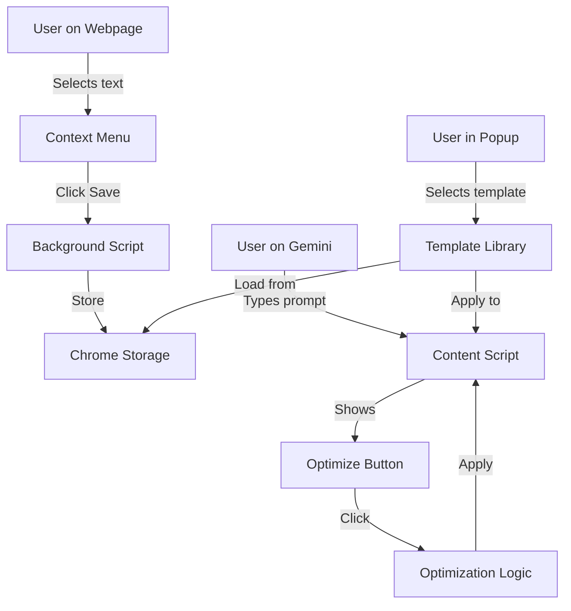

# Product Requirements Document (PRD)
# Gemini Prompt Helper Chrome Extension

**Version:** 1.0  
**Date:** December 16, 2024  
**Author:** PM Agent  
**Status:** Draft

---

## 1. Background & Objectives

### 1.1 Background

Google Gemini is a powerful AI assistant, but many users struggle to write effective prompts that achieve their desired results. Studies show that prompt quality significantly impacts AI output quality, especially for complex tasks like image generation, video creation, and structured content generation.

### 1.2 Problem Statement

**Current Pain Points:**
- Users write vague prompts and get suboptimal results
- Lack of prompt writing knowledge for different use cases (text, image, video)
- Cannot easily reuse successful prompts
- No systematic way to collect and organize good prompts from the web
- Trial-and-error approach wastes time and API credits

### 1.3 Objectives

**Primary Goal:**  
Empower Gemini users to write better prompts and achieve desired results faster.

**Success Metrics:**
- 500+ active users within 3 months
- Average 5+ prompt templates saved per user
- 70%+ user satisfaction rating
- 50%+ reduction in prompt iteration time

### 1.4 Target Audience

**Primary Users:**
- Gemini power users (content creators, designers, developers)
- AI prompt engineers
- Marketing professionals using AI tools
- Students and educators exploring AI

**User Characteristics:**
- Familiar with Gemini interface
- Want to improve AI output quality
- Need to reuse prompts frequently
- Browse web for prompt inspiration

---

## 2. Scope

### 2.1 In Scope

**Phase 1 (MVP):**
1. Prompt optimization floating button on Gemini pages
2. Quick optimization suggestions based on built-in rules
3. Prompt template library (save, organize, apply)
4. Right-click context menu to save selected text as template
5. Template categories (Text, Image, Video, Code, Data)
6. Template import/export (JSON format)
7. One-click template application to Gemini input

### 2.2 Out of Scope

**Not in Phase 1:**
- Cloud synchronization across devices
- AI-powered optimization via external APIs
- Prompt performance analytics
- Community template sharing
- Multi-language support (English only)
- Support for AI platforms other than Gemini

**Future Considerations:**
- Phase 2: Optional API integration for advanced optimization
- Phase 3: Cloud sync with user accounts
- Phase 4: Community template marketplace

---

## 3. Functional Requirements

### 3.1 Core Features

#### Feature 1: Prompt Optimization Button

**Description:**  
Floating button appears on Gemini chat interface to help optimize prompts.

**User Flow:**
1. User types initial prompt in Gemini input box
2. Floating "✨ Optimize" button appears near input
3. User clicks button
4. Extension analyzes prompt and detects intent (text/image/video/code)
5. Shows optimization suggestions in tooltip/modal
6. User reviews suggestions
7. User clicks "Apply" to replace original prompt

**Requirements:**
- R1.1: Button visible only on gemini.google.com
- R1.2: Button positioning doesn't interfere with Gemini UI
- R1.3: Optimization appears within 500ms
- R1.4: Suggestions include: clarity improvements, specificity additions, structure enhancements
- R1.5: User can dismiss suggestions without applying

**Example:**

```
Original: "make me a cat picture"

Optimized:
"Generate a photorealistic image with the following specifications:
- Subject: A fluffy orange tabby cat
- Pose: Sitting on a wooden windowsill, looking outside
- Style: Natural photography style with soft natural lighting
- Background: Blurred garden view through window
- Details: Warm afternoon sunlight, shallow depth of field
- Quality: 4K resolution, high detail"
```

#### Feature 2: Template Library

**Description:**  
Manage and organize prompt templates for quick reuse.

**User Flow:**
1. User clicks extension icon in Chrome toolbar
2. Popup shows template library
3. User sees categories: Text, Image, Video, Code, Data, Custom
4. User can browse, search, edit, delete templates
5. User selects template
6. Template details shown with preview
7. User clicks "Use Template" button
8. Template content auto-fills into Gemini input (if on Gemini page)

**Requirements:**
- R2.1: Support unlimited templates (limited by Chrome Storage)
- R2.2: Each template has: title, category, content, tags, created date
- R2.3: Search by title, category, tags
- R2.4: Edit template content in popup
- R2.5: Delete with confirmation
- R2.6: Duplicate template feature
- R2.7: Export single template or all templates
- R2.8: Import templates from JSON file

**Template Data Structure:**
```json
{
  "id": "uuid-v4",
  "title": "Professional Product Description",
  "category": "text",
  "content": "Write a compelling product description for [PRODUCT]...",
  "tags": ["marketing", "ecommerce", "copywriting"],
  "createdAt": "2024-12-16T10:00:00Z",
  "updatedAt": "2024-12-16T10:00:00Z",
  "usageCount": 5
}
```

#### Feature 3: Save from Web

**Description:**  
Capture good prompts from any webpage via right-click menu.

**User Flow:**
1. User finds useful prompt on webpage (Reddit, Twitter, blog, etc.)
2. User selects the prompt text
3. User right-clicks
4. User sees context menu option: "💾 Save as Prompt Template"
5. User clicks option
6. Dialog appears with:
   - Selected text (editable)
   - Title field (auto-generated or user input)
   - Category dropdown
   - Tags input
7. User clicks "Save"
8. Success notification appears
9. Template added to library

**Requirements:**
- R3.1: Context menu only appears when text is selected
- R3.2: Works on all websites (host_permissions: <all_urls>)
- R3.3: Auto-detect prompt category based on keywords
- R3.4: Pre-fill title from first 50 characters
- R3.5: Allow editing before saving
- R3.6: Duplicate detection (warn if similar template exists)

#### Feature 4: Quick Apply Template

**Description:**  
One-click template application to Gemini input box.

**User Flow:**
1. User on gemini.google.com
2. User opens extension popup
3. User selects template from library
4. User clicks "Use Template" or double-clicks template
5. Template content automatically fills Gemini input box
6. User can edit before sending
7. Gemini input box gets focus for immediate use

**Requirements:**
- R4.1: Only works when on gemini.google.com
- R4.2: Handles both new chat and existing conversation
- R4.3: Replaces current input content (with confirmation if non-empty)
- R4.4: Supports variable placeholders: [VARIABLE_NAME]
- R4.5: If template has variables, show fill-in form before applying

**Variable Example:**
```
Template: "Generate [IMAGE_TYPE] of [SUBJECT] in [STYLE] style"

User fills:
- IMAGE_TYPE: "a photorealistic image"
- SUBJECT: "a mountain landscape"
- STYLE: "impressionist painting"

Result: "Generate a photorealistic image of a mountain landscape in impressionist painting style"
```

### 3.2 Prompt Optimization Rules

**Built-in optimization rules by category:**

#### Text Generation Prompts
**Rules:**
1. Specify desired format (essay, list, table, etc.)
2. Define tone and style (formal, casual, technical, etc.)
3. Set word/character count
4. Include context and background
5. Specify target audience
6. Add constraints (do's and don'ts)

**Template:**
```
Task: [Clear description of what you want]
Format: [Essay/List/Table/Dialogue/etc.]
Tone: [Formal/Casual/Professional/Creative/etc.]
Length: [Word count or detail level]
Context: [Relevant background information]
Audience: [Who will read this]
Requirements: [Specific points to include]
Constraints: [What to avoid]
```

#### Image Generation Prompts
**Rules:**
1. Describe main subject clearly
2. Specify art style (photorealistic, cartoon, oil painting, etc.)
3. Define composition and framing
4. Include lighting details
5. Mention colors and mood
6. Add technical specs (resolution, aspect ratio)

**Template:**
```
Generate a [STYLE] image:
Subject: [Detailed description]
Composition: [Framing, angle, perspective]
Style: [Photorealistic/Artistic/Illustration/etc.]
Lighting: [Natural/Studio/Dramatic/Soft/etc.]
Colors: [Color palette and mood]
Details: [Important elements to include]
Quality: [4K/HD/High detail/etc.]
```

#### Video Generation Prompts
**Rules:**
1. Describe opening scene
2. Specify duration or pacing
3. Define camera movements
4. Include transitions
5. Mention audio/music style
6. Add end goal or CTA

**Template:**
```
Create a [DURATION] video:
Opening: [First scene description]
Sequence: [Scene by scene breakdown]
Camera: [Movement and angles]
Pacing: [Fast/Slow/Dynamic/etc.]
Transitions: [Cut/Fade/Zoom/etc.]
Audio: [Background music style]
Ending: [Final scene and CTA]
```

#### Code Generation Prompts
**Rules:**
1. Specify programming language
2. Define functionality clearly
3. Include input/output examples
4. Mention coding style preferences
5. Note error handling requirements
6. Specify documentation needs

**Template:**
```
Write [LANGUAGE] code to [FUNCTIONALITY]:
Input: [Input format and examples]
Output: [Expected output and format]
Requirements:
  - [Requirement 1]
  - [Requirement 2]
Style: [PEP8/Google/Airbnb/etc.]
Error Handling: [Yes/No and approach]
Documentation: [Comments/Docstrings/README/etc.]
```

#### Data Analysis Prompts
**Rules:**
1. Describe data structure
2. Specify analysis goals
3. Request specific metrics
4. Define visualization needs
5. Mention output format
6. Include interpretation guidance

### 3.3 User Interface Requirements

#### Popup Interface (Extension Icon Click)

**Layout:**
```
+----------------------------------+
|  Gemini Prompt Helper            |
|  [Search templates...]      [⚙️] |
+----------------------------------+
| 📝 Text (15)    | 🎨 Image (23)  |
| 🎬 Video (8)    | 💻 Code (12)   |
| 📊 Data (6)     | ⭐ Custom (4)  |
+----------------------------------+
| Recent Templates:                |
| ✦ Product Description v2         |
| ✦ Blog Post Outline              |
| ✦ Logo Design Prompt             |
+----------------------------------+
| [+ New Template] [📥 Import]     |
+----------------------------------+
```

**Dimensions:** 400px width × 600px height

#### Settings Page (Options Page)

**Sections:**
1. **General Settings**
   - Enable/disable floating button
   - Button position preference
   - Default category for new templates

2. **Template Management**
   - View all templates (table view)
   - Bulk actions (delete, export)
   - Storage usage indicator

3. **Import/Export**
   - Export all templates → JSON file
   - Import templates from file
   - Merge or replace options

4. **About**
   - Extension version
   - User guide link
   - Feedback form

### 3.4 Content Scripts (Gemini Page Integration)

**Injection Points:**
1. Detect Gemini input box: `textarea[aria-label*="Message"]` or similar
2. Insert floating button adjacent to input
3. Listen for input changes to show/hide button
4. Handle template insertion into input box

**UI Components on Gemini Page:**
```
+----------------------------------------+
|  [Gemini Input Box]               ✨   |
|                                        |
|  [Send Button]                         |
+----------------------------------------+
        ↑
   Floating "Optimize" button
```

---

## 4. Non-Functional Requirements

### 4.1 Performance
- NFR1: Popup opens within 200ms
- NFR2: Template search returns results within 100ms
- NFR3: Content script injection doesn't slow page load
- NFR4: Template save completes within 300ms

### 4.2 Usability
- NFR5: Intuitive UI requiring no tutorial
- NFR6: All actions within 3 clicks
- NFR7: Clear error messages
- NFR8: Undo support for critical actions (delete)

### 4.3 Reliability
- NFR9: Data persistence via Chrome Storage Sync
- NFR10: No data loss on crash
- NFR11: Graceful degradation if Gemini UI changes
- NFR12: Backup prompts before bulk operations

### 4.4 Security
- NFR13: No external data transmission
- NFR14: User data stays local (Chrome Storage)
- NFR15: Export files encrypted (optional)
- NFR16: No tracking or analytics

### 4.5 Compatibility
- NFR17: Chrome 120+
- NFR18: Works with Gemini free and paid tiers
- NFR19: Responsive UI (400px to 800px width)

---

## 5. Technical Architecture

### 5.1 Technology Stack

**Frontend:**
- Framework: React 18 + TypeScript
- Build Tool: Vite + vite-plugin-web-extension
- Styling: Tailwind CSS
- State Management: React Context + Hooks

**Chrome Extension:**
- Manifest Version: 3
- Storage: chrome.storage.sync (100KB limit per item)
- Permissions: storage, activeTab, contextMenus, scripting
- Host Permissions: https://gemini.google.com/*

**Data Storage:**
- Templates: Chrome Storage Sync API
- Settings: Chrome Storage Local API
- Export Format: JSON

### 5.2 Extension Architecture

```
chrome-extension/
├── public/
│   ├── manifest.json
│   └── icons/
├── src/
│   ├── popup/              # Main UI (template library)
│   │   ├── Popup.tsx
│   │   ├── components/
│   │   │   ├── TemplateList.tsx
│   │   │   ├── TemplateCard.tsx
│   │   │   ├── CategoryFilter.tsx
│   │   │   └── SearchBar.tsx
│   │   └── hooks/
│   │       └── useTemplates.ts
│   ├── options/            # Settings page
│   │   ├── Options.tsx
│   │   └── components/
│   ├── content/            # Gemini page integration
│   │   ├── content.ts
│   │   ├── FloatingButton.tsx
│   │   └── OptimizationModal.tsx
│   ├── background/         # Service worker
│   │   └── background.ts
│   └── shared/
│       ├── storage.ts      # Storage utilities
│       ├── types.ts        # TypeScript types
│       ├── optimizer.ts    # Prompt optimization logic
│       └── constants.ts    # Categories, rules
└── package.json
```

### 5.3 Data Flow



### 5.4 Chrome Storage Schema

```typescript
// Storage structure
interface StorageData {
  templates: Template[];
  settings: Settings;
  categories: Category[];
}

interface Template {
  id: string;              // UUID v4
  title: string;           // Max 100 chars
  category: CategoryType;  // Enum
  content: string;         // Max 5000 chars
  tags: string[];          // Max 10 tags
  variables: Variable[];   // Template variables
  createdAt: string;       // ISO 8601
  updatedAt: string;       // ISO 8601
  usageCount: number;      // Track popularity
  isFavorite: boolean;
}

interface Settings {
  floatingButtonEnabled: boolean;
  buttonPosition: 'top-right' | 'bottom-right';
  defaultCategory: CategoryType;
  autoOptimize: boolean;
}

type CategoryType = 'text' | 'image' | 'video' | 'code' | 'data' | 'custom';
```

---

## 6. User Stories

### US1: Save Prompt from Web
**As a** content creator  
**I want to** save good prompts I find online  
**So that** I can reuse them for my projects

**Acceptance Criteria:**
- Can select text on any webpage
- Right-click shows "Save as Prompt Template"
- Save dialog allows editing before save
- Template appears in library immediately

### US2: Optimize Existing Prompt
**As a** Gemini user  
**I want to** improve my vague prompts  
**So that** I get better results from Gemini

**Acceptance Criteria:**
- Floating button appears on Gemini page
- Click shows optimization suggestions
- Can apply or dismiss suggestions
- Original prompt not lost

### US3: Quick Apply Template
**As a** frequent Gemini user  
**I want to** quickly apply saved templates  
**So that** I don't have to retype common prompts

**Acceptance Criteria:**
- Can browse templates by category
- Click template to apply to Gemini input
- Template fills input automatically
- Can edit after applying

### US4: Organize Templates
**As a** power user with many templates  
**I want to** organize and search templates  
**So that** I can find what I need quickly

**Acceptance Criteria:**
- Can filter by category
- Can search by title/tags
- Can favorite important templates
- Can sort by usage or date

### US5: Share Templates
**As a** team member  
**I want to** export and share my templates  
**So that** my team can use the same prompts

**Acceptance Criteria:**
- Can export all templates to JSON
- Can export selected templates
- Can import templates from file
- No data loss during import/export

---

## 7. Success Criteria

### 7.1 Launch Criteria
- [ ] All core features working
- [ ] No critical bugs
- [ ] Tested on Chrome 120+
- [ ] Performance meets NFRs
- [ ] User guide completed
- [ ] Chrome Web Store listing ready

### 7.2 Success Metrics (3 Months Post-Launch)

**Adoption:**
- ✅ 500+ active users
- ✅ 4.0+ star rating on Chrome Web Store
- ✅ <5% uninstall rate

**Engagement:**
- ✅ 5+ templates saved per user (average)
- ✅ 3+ template uses per week (average)
- ✅ 70%+ users use optimization button

**Quality:**
- ✅ <10 reported bugs per month
- ✅ 70%+ user satisfaction (survey)
- ✅ <500ms average response time

---

## 8. Timeline & Milestones

### Phase 1: MVP Development (2 weeks)

**Week 1:**
- Day 1-2: Technical architecture design
- Day 3-4: Chrome Extension skeleton + UI mockups
- Day 5-7: Core storage and template management

**Week 2:**
- Day 8-10: Content script + floating button
- Day 11-12: Context menu + save functionality
- Day 13-14: Testing, bug fixes, polish

**Deliverable:** Working Chrome Extension (unpacked)

### Phase 2: Polish & Launch (1 week)

**Week 3:**
- Day 15-16: User guide and documentation
- Day 17-18: Chrome Web Store listing preparation
- Day 19: Internal testing
- Day 20: Submit to Chrome Web Store
- Day 21: Launch and monitor

**Deliverable:** Live on Chrome Web Store

---

## 9. Risks & Mitigations

| Risk | Impact | Probability | Mitigation |
|------|--------|-------------|------------|
| Gemini UI changes break extension | High | Medium | Use robust selectors, add version detection |
| Chrome Storage limit exceeded | Medium | Low | Implement storage usage warnings, archive old templates |
| Context menu not working on some sites | Medium | Low | Test on top 50 websites, fallback to copy button |
| User finds optimization suggestions unhelpful | High | Medium | A/B test rules, allow user to submit feedback |
| Low adoption rate | High | Medium | Launch on Product Hunt, AI community forums |

---

## 10. Open Questions

1. **Q:** Should we add keyboard shortcuts?
   **A:** Nice-to-have for Phase 2

2. **Q:** Support for Gemini Advanced features?
   **A:** Yes, test with both free and paid tiers

3. **Q:** Template sharing community in future?
   **A:** Phase 3 consideration, requires backend

4. **Q:** Multi-language support priority?
   **A:** Start English-only, add based on user requests

---

## 11. Appendix

### A. Competitive Analysis

**Existing Solutions:**
1. **AIPRM** (ChatGPT extension)
   - ✅ Large prompt library
   - ✅ Community sharing
   - ❌ Doesn't support Gemini
   - ❌ Requires account

2. **PromptPerfect**
   - ✅ AI-powered optimization
   - ❌ Web-based, not browser extension
   - ❌ Subscription required

**Our Differentiators:**
- ✅ Gemini-specific optimization
- ✅ No account required
- ✅ 100% free and open source
- ✅ Privacy-first (local storage)

### B. Reference Prompts

**Example Templates to Pre-populate:**

1. **Text - Professional Email**
```
Write a professional email with the following details:
- Recipient: [RECIPIENT_NAME]
- Purpose: [PURPOSE]
- Tone: [FORMAL/CASUAL/FRIENDLY]
- Key Points:
  * [POINT_1]
  * [POINT_2]
  * [POINT_3]
- Desired Action: [CALL_TO_ACTION]
```

2. **Image - Product Photography**
```
Generate a professional product photograph:
- Product: [PRODUCT_NAME]
- Angle: [TOP/SIDE/45-DEGREE/etc.]
- Background: [CLEAN_WHITE/LIFESTYLE/STUDIO/etc.]
- Lighting: Professional studio lighting with soft shadows
- Composition: Product centered, rule of thirds
- Quality: 4K resolution, high detail, commercial quality
- Style: E-commerce product photography
```

3. **Video - Tutorial**
```
Create a [DURATION] tutorial video:
- Topic: [TOPIC]
- Target Audience: [AUDIENCE]
- Key Steps:
  1. [STEP_1]
  2. [STEP_2]
  3. [STEP_3]
- Style: Screen recording with voiceover
- Pacing: Clear and beginner-friendly
- Includes: Title cards, transitions, background music
```

---

## 12. Change Log

| Version | Date | Author | Changes |
|---------|------|--------|---------|
| 1.0 | 2024-12-16 | PM Agent | Initial PRD |

---

**Document Status:** ✅ Ready for Technical Design

**Next Steps:**
1. SA Agent: Technical architecture design
2. UI/UX Agent: Interface wireframes
3. Fullstack Agent: Implementation

---

**Approval:**
- [ ] Product Manager
- [ ] Engineering Lead
- [ ] Design Lead
- [ ] Stakeholders
